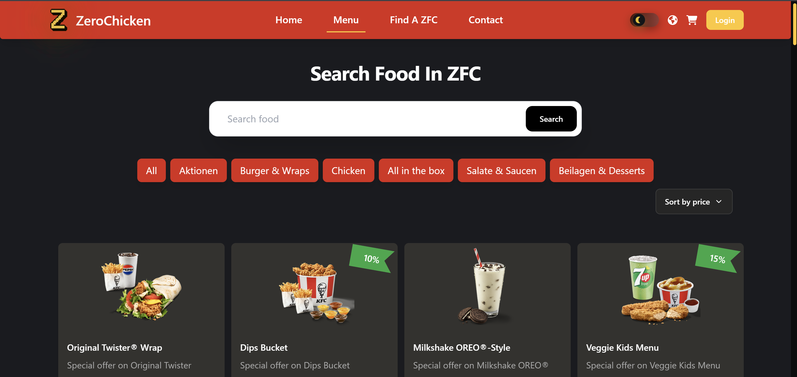
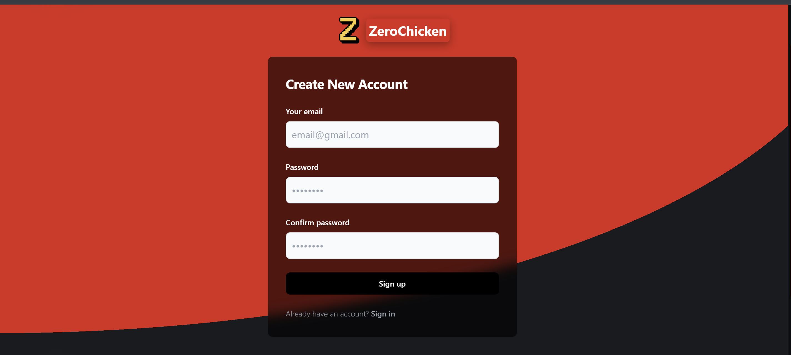

<div align="center"><h1>REACT-FOOD-KFC</h1></div>

<div align="center">

[](https://skillicons.dev)

   

</div>

## Giới thiệu

`React Food KFC` là một ứng dụng web được xây dựng bằng React.js, sử dụng Babel để biên dịch mã JavaScript và Sass để quản lý kiểu dáng. Dự án này giúp bạn hiểu cách thiết lập một môi trường phát triển với React, Babel, và Sass từ đầu.

## Các tính năng

- **React**: Xây dựng giao diện người dùng động với React.
- **Babel**: Chuyển đổi mã ES6+ sang ES5 để tương thích với các trình duyệt.
- **Sass**: Quản lý kiểu dáng với Sass cho CSS linh hoạt và dễ bảo trì.
- **Prettier**: Định dạng mã nguồn tự động để đảm bảo sự nhất quán.

## Cài đặt

### Yêu cầu

- Node.js (Phiên bản 14.x hoặc cao hơn)
- npm (Node Package Manager)

### Cài đặt Dự án

1. **Clone dự án:**

   ```bash
   git clone https://github.com/ChickenSoup269/React-Food-KFC.git
   cd React-Food-KFC
   ```

2. **Cài đặt các phụ thuộc:**

   ```bash
   npm install
   ```

3. **Chạy ứng dụng:**

   ```bash
   npm start
   ```

   Mở trình duyệt và truy cập `http://localhost:3000` để xem ứng dụng.

### Các lệnh hữu ích

- **Xây dựng dự án cho môi trường sản xuất:**

  ```bash
  npm run build
  ```

- **Chạy các kiểm tra:**

  ```bash
  npm test
  ```

- **Chạy Prettier để định dạng mã nguồn:**

  ```bash
  npm run format
  ```

## Screenshots

<div style='padding:10px'>

<kbd>

</kbd>

<kbd>

</kbd>

<kbd>

</kbd>

</div>

## Đóng góp

Chúng tôi hoan nghênh tất cả các đóng góp! Nếu bạn muốn đóng góp vào dự án, vui lòng làm theo các bước sau:

1. **Fork dự án**
2. **Tạo một nhánh mới (`git checkout -b my-new-feature`)**
3. **Thực hiện thay đổi và commit (`git commit -am 'Add some feature'`)**
4. **Push nhánh lên GitHub (`git push origin my-new-feature`)**
5. **Mở Pull Request**

## Liên hệ

Nếu bạn có bất kỳ câu hỏi nào hoặc muốn thảo luận thêm về dự án, hãy liên hệ với chúng tôi qua:

- **Email**: [your-email@example.com](mailto:your-email@example.com)
- **GitHub**: [github.com/username](https://github.com/username)

## Giấy phép

[](https://choosealicense.com/licenses/mit/)

Dự án này được cấp phép theo [MIT License](LICENSE).

---

Cảm ơn bạn đã xem dự án của chúng tôi!
